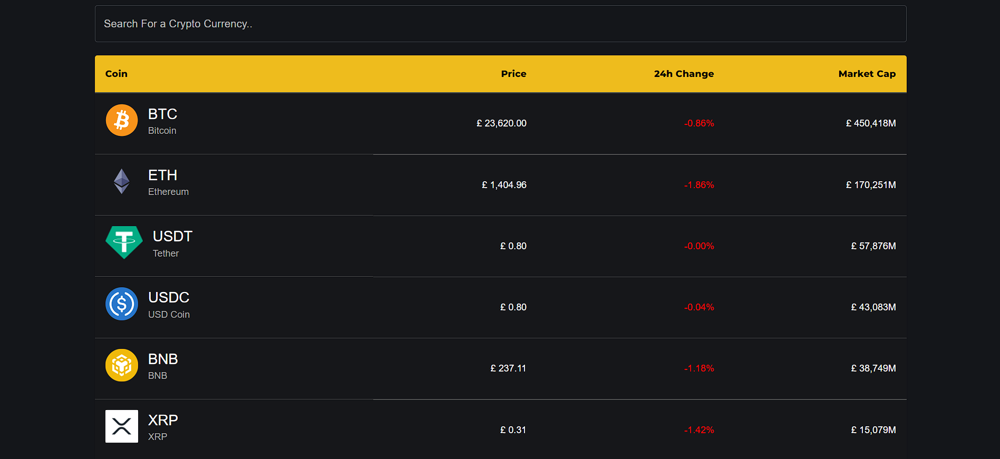

 # Cryptocurrency Tracker with React JS, Material UI and Chart JS

## [Watch Full Tutorial on Youtube here](https://youtu.be/QA6oTpMZp84)

## Demo
#### Here is a working live demo :  https://crypto-hunter.netlify.app/

## Built with 

- [React JS](https://reactjs.org/)
- [Material UI](https://v4.mui.com/)
- [Chart JS](https://reactchartjs.github.io/react-chartjs-2/#/)

## Made with ♥ By [Roadside Coder](https://www.youtube.com/channel/UCIPZVAwDGa-A4ZJxCBvXRuQ)

MIT © [Piyush Agarwal ](https://github.com/piyush-eon)

# CryptoVerse

## Table of contents

- [General ](#general-info)
- [Tools and Technologies used](#tools-and-technologies-used)
- [Features](#features)

## General Info

> A web app that displays the current rate of popular crypto currencies. 
> Designed and developed using HTML, CSS, React.js, Chart.js and hosted on Netlify. Used Coin Gecko API to fetch crypto currency rates.

## Tools and Technologies used

1. <b>React.js </b> :- To build components and to manage the state of the app.
2. <b> Chart.js </b> :- To generate historical charts
3. <b> Material-UI </b> :- For a user friendly frontend.
4. <b> Netlify </b> :- For hosting

## Features

### Trending Movies:-

### Movies displayed category wise:-
 

### Series displayed category wise:-
 

### Search
 

